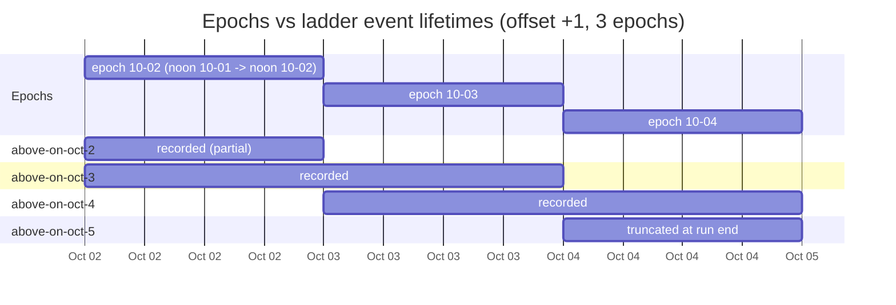

# Context: daily-epoch recording for Polymarket BTC markets

Design/context document for reworking `go-collector` around a **daily epoch**.
Written 2026-10-02. All Gamma/CLOB facts below were verified live on that date.

Phases 1 and 2 (§11) are implemented; §13 lists what is still outstanding —
start there if you are picking this up rather than reading it end to end.

---

## 1. Goal

Record, on a **daily epoch**, for BTC:

| family | Gamma series slug | markets/event | settles |
|---|---|---|---|
| Up/Down 1h | `btc-up-or-down-hourly` | 1 | Binance BTC/USDT 1h candle, close ≥ open |
| Up/Down 4h | `btc-up-or-down-4h` | 1 | Chainlink TWAP over range vs range-start price |
| Up/Down 1d | `btc-up-or-down-daily` | 1 | Binance BTC/USDT 1m close @12:00 ET, prev day vs title day |
| Above/Below | `btc-multi-strikes-weekly` | 11 (strike ladder) | Binance BTC/USDT 1m close @12:00 ET on title date > strike |
| Price Range | `bitcoin-neg-risk-weekly` | 11 (range ladder) | Binance BTC/USDT 1m close @12:00 ET on title date → bucket |

Plus the underlying spot market: **Binance `BTCUSDT` spot** (aggTrade + depth + 5m klines) and
Polymarket RTDS/Chainlink reference prices.

The settlement candles are the whole point of the spot recording: every BTC family above settles on
a **Binance BTC/USDT 1-minute candle** (except up/down 4h, which settles on Chainlink TWAP).
`kline_5m` is recorded as an integrity cross-check, and the actual 1-minute candle is **derived from
`aggTrade`** — see §7.

Out of scope for now: **Hit Price** (`bitcoin-hit-price-daily`, 16 markets, settles on the
*midnight*-ET day, not noon ET) — different epoch alignment, phase 3.

---

## 2. The daily epoch

### Definition

```
epoch D  =  [ 12:00 ET on D−1 ,  12:00 ET on D )
             └── 16:00Z (EDT) / 17:00Z (EST) boundaries ──┘
```

* Epoch id is the **ET settlement date** `YYYY-MM-DD` — i.e. the day the markets settle, which is
  also the date in the market title (`bitcoin-above-on-october-3-2026` → epoch `2026-10-03`).
* Noon ET is chosen because **3 of the 4 families settle at 12:00 ET on their title date**, and the
  4th (up/down 1d) compares the 12:00 ET candle of the previous day against the title day's — so one
  noon→noon epoch is exactly one settlement cycle: the window an up/down-daily market compares, and
  the final day of the (7-day) trading window of one ladder generation.
* Both the 1h and 4h up/down windows tile a noon→noon epoch exactly:
  * 4h: `12–16, 16–20, 20–00, 00–04, 04–08, 08–12` ET → 6 windows
  * 1h: 24 windows
* Boundaries must be computed in `America/New_York`, never by `time.Truncate(...)` on UTC —
  noon ET is 16:00Z under EDT and 17:00Z under EST. **Never derive the epoch from a UTC truncation.**

### Why this replaces the current model

Today `pkg/libs/rolling.go` **synthesizes** market slugs (`GenerateMarketSlug`) and truncates
`time.Now()` to the interval. That is wrong for everything except 5m/15m:

* `btc_1h` builds the slug from the **UTC** hour while Polymarket labels hourly markets by the
  **ET** hour. Verified 2026-10-02 05:19Z: generated `bitcoin-up-or-down-october-2-2026-5am-et`
  (window 09:00–10:00Z) instead of the live `…-1am-et` (05:00–06:00Z). It records the wrong market.
* A daily epoch cannot be expressed by `Truncate(24h)` (that is UTC midnight = 20:00 ET).
* Ladders cannot be expressed by a slug at all (1 event → 11 markets).
* Window anchors differ per family (noon ET vs midnight ET vs 7-day trading windows).

**Slug synthesis is to be deleted.** Everything is *discovered* from Gamma and anchored on the epoch.

---

## 3. Discovery (replaces slug synthesis)

Verified working:

```
GET /series?slug=<seriesSlug>                  → series incl. id, recurrence, events[]
GET /events?series_id=<id>&closed=false&limit= → []Event, each with nested markets[]   ✅
GET /events?slug=<eventSlug>                   → single Event with nested markets[]     ✅
GET /markets?slug=<marketSlug>                 → single market (existing connector path) ✅
```

* Requires a `User-Agent` header, otherwise 403.
* From `/events?series_id=…` we get, per event: `slug`, `ticker`, `startDate`, `endDate`,
  `seriesSlug`, `closed`, `tags`, and `markets[]` with `slug`, `groupItemTitle` (the strike),
  `outcomes`, `conditionId`, `clobTokenIds`, `description`, `negRisk`.
* The event-level `startDate → endDate` is the **trading** window, **not** the settlement instant.
  Settlement comes from the market `description` + the title date.

Runtime flow — implemented as `EpochScheduler.reconcile`, which is idempotent and
runs on every tick (a boundary, or at most every 30s):

```
reconcile(now)
  └─ roll the epoch if the anchor boundary has passed   # writes the ended epoch's manifest
     └─ for each configured series:
          for each offset (0, and 1 for the ladder families):
            target = spec.TargetSettle(now)            # or TargetSettle(now + offset days)
            if already claimed, or already settled → skip (no HTTP at all)
            resolve series id (cached)
            list open events for that series
            select the event whose EndDate == target   # see below; exactly one, or abort
            epoch = EpochForSettle(target)
            for each market (strike-filtered):
                ensure a RecordingSession exists (keyed by marketID)
```

The claim memo is what makes a 30s poll free: an hourly target is claimed once an
hour, a daily one once a day, and anything that failed (market not published yet,
Gamma unreachable) is retried on the next tick.

`EpochScheduler.Plan(ctx, now)` runs the same discovery and selection without
starting anything, and is what `.tmp/smoke` dry-runs a config with.

### Selecting the event — match on `EndDate`, never on window containment

⚠️ **An event's `[startDate, endDate)` is its TRADING window, not its market window.**
Intraday events open roughly two days early, so many events contain `now` at the same time.
Verified 2026-10-02 06:55Z: both `bitcoin-up-or-down-october-2-2026-2am-et`
(`2026-09-30 06:00Z → 2026-10-02 07:00Z`) *and* `…-october-2-2026-5am-et`
(`2026-09-30 09:00Z → 2026-10-02 10:00Z`) satisfied "window contains now" — and 47 more
hourly events did too. Picking by containment silently records the wrong market.

The rule is therefore:

```
target settle instant:
  intraday (AnchorETBoundary) → end of the ET-aligned IntervalWindow(now, interval)
  daily (noon/midnight)       → end of EpochBounds(EpochID(now, anchor), anchor)

select the event with  EndDate == settle instant          (the epoch's own settlement)
and, for ladder_offset_days ≥ 1, also  EndDate == settle instant + n windows/epochs
```

This one rule covers every family and makes the `+1` offset fall out for free:

| family | target settle | next |
|---|---|---|
| `btc_1h` | 07:00Z (end of the ET 2am–3am window) | 08:00Z |
| `btc_4h` | 08:00Z (end of the ET 00:00–04:00 window) | 12:00Z |
| `btc_1d` / `btc_above` / `btc_range` | 16:00Z (noon ET) | 16:00Z next day |

**More than one match is recorded, never guessed at and never fatal.** On a DST transition day
Polymarket's own generator emits two markets ending at the same instant: verified against Gamma
on 2026-10-02, on 2026-03-08 (US clocks jump 02:00→03:00 EST) the hourly series carried
**both** `…-march-8-2026-12am-et` and `…-march-8-2026-1am-et`, both ending `06:00Z` — the local
01:00 hour that never happened. The mirror case is a hole rather than a duplicate: on
2025-11-02 (clocks fall back) the repeated 01:00–02:00 hour produced **no** events at all, so
that day's `06:00Z` and `07:00Z` targets match nothing.

Both are real markets settling on the same candle, so `SelectEvents` returns every match and the
scheduler claims each one (the epoch manifest keeps them apart by `event_slug`). The earlier
"assert exactly one, abort otherwise" rule would have killed a multi-day run over a calendar
artefact; the current rule costs at most a duplicated market at one instant out of the year. A
target with no event at all is logged as a **warning when it is within 5 minutes of settling**
(once per target) — that is the signature of a DST-grid gap or a Gamma outage, and it is exactly
the hole the fall-back hour produces.

Verified against live Gamma on 2026-10-02 for all five BTC families
(`.tmp/smoke` re-runs this check, and now exercises the real scheduler: `go run
./.tmp/smoke -config collector_daily.yaml`).

Note: `GammaMarket.GroupItemTitle` is empty for up/down markets (they have no strike) and
carries an inequality for range markets (`"<74,000"` rather than a plain strike), so store the
raw label verbatim and parse `range_low`/`range_high`/`strike` from it separately.

---

## 4. Ladder structure and the +1 offset

`btc-multi-strikes-weekly` (`series_id=45`) verified 2026-10-02:

* **7 dated events open at once** — `bitcoin-above-on-october-2..8-2026`, **same 11 strikes**
  (74,000 … 94,000). The strike set is refreshed weekly; a new dated event is created daily.
* Each event's window is ~7 days of *trading*, but it settles on **one** 1m candle at 12:00 ET on
  its title date. Price Range (`bitcoin-neg-risk-weekly`) has the identical structure.
* ≈ **77 concurrent markets per ladder family**.

### Offset rule

On each epoch `D`, hold sessions for the ladder events dated **D and D+1**:

```
D = oct 2 → events oct-2, oct-3
D = oct 3 → events oct-3, oct-4
D = oct 4 → events oct-4, oct-5      ← run ends; oct-5 truncated (never settles in-run)
                                           distinct events: 2, 3, 4, 5
```

`count/days = 3` therefore touches **4** distinct dated events; the first and last are partial.
The offset exists so that every ladder event accumulates a **full pre-settlement history** before
it settles (each event ends up with ~48h of recording: it is picked up as the "+1" event of the
previous epoch and settles at the end of its own epoch).



---

## 5. On-disk layout

```
data/
  market/
    2026-10-02/                                  # epoch id = the epoch that settles here
      manifest.json                              # epoch index (§6) — every market by family/event
      5169514/                                   # one dir per market, named by Gamma market id
        events.gz                                #   every <marketID>/ dir holds both
        metadata.json
      5169515/
      …                                          # 24 hourly + 6 four-hourly + 1 daily + 11 above
                                                 # + 11 range markets, when all families are on
    2026-10-03/
      …
  rtds/
    btcusdt_2026-10-02/events.gz                 # daily bucket, noon→noon ET
    btc_usd_2026-10-02/events.gz
    chainlink_twap_btc_usd_2026-10-02/events.gz
  binance/
    spot/btcusdt_2026-10-02/events.gz            # aggTrade + depth + final kline_5m (mixed types)
    spot/btcusdt_2026-10-02/metadata.json        # feed metadata (market dir + lowercase symbol)
    perp/btcusdt_2026-10-02/events.gz
```

Rules:

* **Market recordings are keyed by the epoch their settlement falls in**
  (`data/market/<epoch>/<marketID>/`), and the directory is named by the Gamma
  **market id**, not the slug: slugs are not unique across years (`market_id` is
  the join key, the slug is a label — §6). A session may be written across two
  epochs (the +1 ladder event), but it lands in exactly one folder.
* The filing rule is `libs.EpochForSettle`: the epoch that **ends** at the settle
  instant when the instant is the anchor (all the daily/ladder families settle at
  noon ET), otherwise the epoch containing it (the intraday families settle at
  the end of their own window). That is what makes a directory equal one
  settlement cycle — and it means **every market claimed while epoch D was
  running is filed under D**, so D's manifest is complete the moment D rolls.
* A market's **title date is not always its epoch**. An intraday market is named
  after the date its window *opens*: `bitcoin-up-or-down-october-2-2026-2pm-et`
  settles at 15:00 ET on the 2nd and is filed under `2026-10-03`, the epoch that
  closes at noon on the 3rd. `metadata.json` carries `epoch_id` (where the
  recording is filed) and `event.settle_date_et` (the date in the title)
  separately.
* Per epoch that resolves to exactly the counts §2 promises: **24** hourly
  windows and **6** four-hourly windows (see the `TestEpochForSettleCountsPerEpoch`
  test, which walks a day of windows and buckets them).
* **Feed recordings are keyed by the wall-clock epoch bucket** — same noon→noon
  ET boundary, so `…_2026-10-02` covers `[noon Oct 1 ET, noon Oct 2 ET)`. All
  families settle on the 12:00 ET candle, which is the **first** point of the
  epoch that *opens* there: a market settling at noon on D derives from
  `…_2026-10-0(D+1)`, not `…_2026-10-0D`. Python must handle the edge; the
  per-market `settlement.derived_from` names the right bucket, so nothing has to
  re-derive it.
* Binance feed folders must include the market (`spot`/`perp`) — before this, both wrote to
  `data/binance/btcusdt_<ts>/events.gz` and `os.Create` truncated each other (see §9). Bucket names
  use the lowercased symbol (`btcusdt`) to stay consistent with recordings already on the server.
* **A feed bucket may be split into parts.** A day of `aggTrade` + top-20 depth runs to hundreds of
  MB compressed, which is awkward to `scp`, to open, and to lose to one write error, so the
  `FeedRecorder` starts a new part once the open one passes `DefaultFeedPartBytes` (256 MiB). The
  first part keeps the name `events.gz` (so a bucket that never rotates is unchanged and a reader
  that only opens `events.gz` still works on it); later parts are `events.001.gz`, `events.002.gz`,
  … The read order is **`events.gz` first, then the numbered parts in numeric order**, which is what
  the bucket's `metadata.json` records in `parts` — note that a plain `events*.gz` glob sorts
  `events.001.gz` *ahead of* `events.gz`, so the list, not a glob, is the order. `download.sh`
  pulls the whole bucket with `scp -r`, so parts come along automatically.
* Session state: a truncated session (run ended before its settlement) must be marked
  `resolution: "unsettled"` in `metadata.json`, never given a synthetic outcome; the epoch
  manifest flags it too.
* Every `<marketID>/metadata.json` is **self-describing** — family, event, ladder rung, settlement
  anchor and rule — so a market can be replayed with no external lookup. See §6.

---

## 6. Per-market metadata

Each market writes its **own** `metadata.json`. It must be complete enough that a reader can group
markets into families/events, know each market's rung in a ladder, and recompute the settlement
outcome without calling Gamma.

`data/market/<epoch>/<marketID>/metadata.json`:

```json
{
  "market_id": "5169514",
  "slug": "bitcoin-above-80k-on-october-2-2026",
  "question": "Bitcoin above ___ on October 2?",
  "condition_id": "0x43bd…",
  "yes_asset_id": "1234…",
  "no_asset_id": "5678…",

  "epoch_id": "2026-10-02",
  "start_time": 1790812800000,
  "end_time": 1790851200000,
  "recorded_at": 1790851300000,
  "event_count": 184223,
  "truncated": false,
  "family": {
    "name": "above",
    "interval": "1d",
    "asset": "BTC",
    "series_slug": "btc-multi-strikes-weekly",
    "series_id": "45",
    "recurrence": "weekly"
  },

  "event": {
    "slug": "bitcoin-above-on-october-2-2026",
    "ticker": "bitcoin-above-on-october-2-2026",
    "title": "Bitcoin above ___ on October 2?",
    "settle_date_et": "2026-10-02",
    "trading_window_start": 1790284800000,
    "trading_window_end": 1790851200000,
    "ladder_size": 11,
    "ladder_index": 3,
    "strike": 80000,
    "strike_label": "80,000",
    "range_low": null,
    "range_high": null,
    "outcomes": ["Yes", "No"],
    "neg_risk": false,
    "neg_risk_market_id": "",
    "offset_days": 1,
    "is_settlement_epoch": false
  },

  "settlement": {
    "at": 1790851200000,
    "window_start": 1790764800000,
    "anchor": "noon_et",
    "source": "binance_1m_close",
    "symbol": "BTCUSDT",
    "market": "spot",
    "comparison": "above_strike",
    "rule_text": "This market will resolve to \"Yes\" if the Binance 1 minute candle for BTC/USDT 12:00 in the ET timezone (noon) on the date specified in the title has a final \"Close\" price higher than the price specified in the title. …",
    "derived_from": "binance/spot/btcusdt_2026-10-03"
  },

  "strike_filter": {
    "limit": 3,
    "basis": "spot",
    "spot": 84120.0,
    "kept": 6,
    "total": 11
  },

  "resolution": "yes",
  "winning_outcome": "YES",
  "resolution_basis": "onchain",
  "synthetic_resolve": false,
  "open_price": 83771.69,
  "close_price": 84120.0,
  "last_midprice": 0.62,
  "data_quality": { "…": "…" },
  "connections": { "…": "…" },
  "raw_market": { "…": "verbatim Gamma payload …" }
}
```

Field notes:

* `family.*` — which market family the market belongs to, so a reader can group markets across
  epochs (`name` is `updown` | `above` | `range` | `hit`; `interval` is `1h` | `4h` | `1d`).
* `event.*` — the Gamma event it belongs to. `ladder_size` / `ladder_index` / `strike` identify its
  rung (`strike` parsed from `groupItemTitle`). **`ladder_size` and `ladder_index` always describe
  the event's full ladder**, even when the strike filter kept only some rungs, so a filtered
  recording still says where each market sits. For `range` markets `range_low` / `range_high` are
  populated instead of `strike`; for `updown` (ladder_size 1) all three are null and `ladder_index`
  is -1. `settle_date_et` is the date named in the market **title**, which is *not* always
  `epoch_id` — see §5.
* `settlement.*` — `at` is the anchor instant (noon ET on the settle date; midnight ET for `hit`),
  and `window_start` is the opening instant of the window the settlement **compares**: the
  family's own interval back from the anchor, so the intraday families name the candle whose close
  decides them, the daily ones name the previous noon (the candle the market compares its own close
  against), and `hit` names midnight ET of the observed day. With `at` it bounds the window
  `open_price` / `close_price` are derived over, so post-processing does not have to re-derive the
  convention from `family.interval`.
  `anchor` is `noon_et` | `midnight_et` | `et_boundary` (the intraday families, which have no daily
  hour). `source` is the resolution rule: `binance_candle` | `binance_1m_close` | `binance_1m_high`
  | `chainlink_twap`. `derived_from` names the feed bucket the outcome can be recomputed from,
  relative to the data root — and it is the bucket that *opens* at the settle instant, i.e. the
  **next** epoch (§5). It is **empty** when the settlement source was not recorded, so an empty
  value means "cannot be recomputed from our data" rather than an invented path.
* `resolution_basis` — **how** the outcome was decided, so a synthesized one is never taken at face
  value: `onchain` (the market's own `market_resolved` message), `collapsed_book` (the order book
  had already gone one-sided when we looked — see below), `midprice` (still two-sided, so this is
  the 0.5-boundary fallback), or `no_book`. Empty for an unsettled market.
* `strike_filter` — the ladder rung filter this market was claimed under (`limit` per side,
  `basis`: `all` | `spot` | `median_rung`, the `spot` it centred on, and `kept` of `total` rungs).
  The first claim of a run happens before the RTDS feed has delivered a price, so it centres on the
  ladder's median rung instead of spot; two runs can therefore legitimately hold different rung
  sets, and this block is what says which. Null for the non-ladder families.
* `is_settlement_epoch` — relative to the epoch the market was **picked up** in: true when it was
  claimed as that epoch's own settlement event, false when it was claimed as the `+1` carry. A
  ladder market is always picked up as a `+1` first (that is the point of the offset), so it carries
  `offset_days: 1, is_settlement_epoch: false` for its whole life.
* `truncated: true` **and** `resolution: "unsettled"` for a session the run ended before settlement
  — never synthesize an outcome for these. The epoch manifest flags the same markets.
* `raw_market` keeps the verbatim Gamma payload, so nothing is lost if a field above is misparsed.
* `open_price` / `close_price` are left **empty** by the collector. They are computed in
  post-processing from the recorded feeds (see `settlement.derived_from`) — those feeds *are* the
  settlement source, so deriving them there is strictly better than a price-API round trip. The
  old `fetchWindowPrices` call (and its `cryptoPriceTWAPLookback` constant) has been deleted.
* A market whose resolution message never arrives is decided from the **last order book** taken a
  minute past the settle instant (`SyntheticResolveAfter`), and the collapsed-book bounds come
  first because they are evidence rather than a guess:

  ```
  YES won → bids at ~0.99, no ask → mid = (0.99 + 1.00)/2 = 0.995   → YES, basis collapsed_book
  NO won  → asks at ~0.01, no bid  → mid = (0.00 + 0.01)/2 = 0.005   → NO,  basis collapsed_book
  ```

  The substituted `1.00` / `0.00` are `midpriceFromBook`'s defaults for a missing side, which is
  what makes a one-sided (i.e. already settled) book readable at all. A midprice still between
  those bounds means the book had not collapsed when we looked — typically frozen since before
  settlement — so the outcome falls back to the 0.5 boundary and is recorded as `midprice`; a
  session with no book at all defaults to NO and is recorded as `no_book`.
* `market_id` is the folder name and the join key; `slug` is a label. Gamma slugs are not
  guaranteed unique over years (older events omit the year, e.g. `bitcoin-above-on-february-23`),
  so never key analysis on the slug alone.

### Epoch index — `data/market/<epoch>/manifest.json`

One file per epoch listing what it contains, grouped by family and event, so a reader never has to
scan directories:

```json
{
  "epoch_id": "2026-10-02",
  "epoch_start": 1790812800000,
  "epoch_end": 1790851200000,
  "anchor": "noon_et",
  "run": { "days": 3, "ladder_offset_days": 1, "anchor": "noon_et", "started_at": 1790813000000 },
  "feeds": {
    "binance": ["spot/btcusdt_2026-10-02"],
    "rtds": ["btcusdt_2026-10-02", "btc_usd_2026-10-02", "chainlink_twap_btc_usd_2026-10-02"]
  },
  "series": [
    {
      "series": "btc_1h", "family": "updown", "interval": "1h", "asset": "BTC",
      "gamma_series": "btc-up-or-down-hourly",
      "settle_at": 1790851200000,
      "markets": [{ "market_id": "…", "slug": "bitcoin-up-or-down-october-2-2026-11am-et" }]
    },
    {
      "series": "btc_above", "family": "above", "interval": "1d", "asset": "BTC",
      "gamma_series": "btc-multi-strikes-weekly",
      "event_slug": "bitcoin-above-on-october-2-2026",
      "ladder_size": 11, "settle_at": 1790851200000,
      "markets": [
        { "market_id": "…", "strike_label": "74,000", "strike": 74000 },
        { "market_id": "…", "strike_label": "76,000", "strike": 76000 }
      ]
    }
  ],
  "offset_events": ["bitcoin-above-on-october-3-2026", "bitcoin-price-on-october-3-2026"]
}
```

`series` is a **list**, not a map keyed by family: each entry is self-describing (series +
family + interval + asset + gamma slug + settlement), which keeps the Go type concrete instead
of a heterogeneous `map[string]any`. `ManifestMarket` carries the rung geometry
(`strike` / `range_low` / `range_high` / verbatim `strike_label`) plus `offset_days` and
`truncated` so a reader can tell a `+1` event or a partial recording apart without opening the
per-market metadata. One entry per (series, settle instant): an epoch therefore holds 24 entries
for `btc_1h` and 6 for `btc_4h`, and one per dated event for a ladder.

The manifest is written whenever a claim is made (so a hard kill still leaves an index), when an
epoch rolls, and at shutdown — at which point truncated markets are flagged. `offset_events`
lists the event slugs **claimed during this epoch** that settle in the next one; the same events
also appear in the next epoch's `series` list as its own settlement events.

### Feed metadata

Feed files are cut on the same epoch boundary and carry their own `metadata.json`
(`feed`, `symbol`, `market`, `epoch_id`, `start_time` / `end_time` = epoch bounds, `event_count`,
`event_counts`, `data_quality`, `connections`). With `kline_5m` enabled, `event_counts` gains a
`binance_kline` entry; only **final** klines (`isFinal: true`) are persisted — intermediate kline
updates are redundant with `aggTrade`.

---

## 7. Config schema (proposed)

```yaml
recording:
  days: 3                  # number of daily epochs to record
  epoch: noon_et           # daily epoch boundary: noon_et (recommended) | midnight_et
  ladder_offset_days: 1    # also hold the next settlement day's ladder

series:
  - series: btc_1h         # resolved through the registry (libs/series.go)
  - series: btc_4h
  - series: btc_1d
  - series: btc_above
    strikes: 3             # ladder rungs to keep each side of spot; 0 = all
  - series: btc_range
    strikes: 3

feeds:
  binance:
    spot:
      symbols: [BTCUSDT]
      streams: [aggTrade, depth, kline_5m]
  rtds:
    crypto_prices: [btcusdt, btc/usd]
    chainlink_twap: [btc/usd]     # only the up/down 4h family needs it
```

Notes:

* `count` (number of intervals) is **replaced by `days`** (number of epochs) — the whole schedule is
  daily now.
* The series block is the **registry shorthand** (`btc_1h`, `btc_above`), not `family:` +
  `interval:`. The registry is the single source of truth for the Gamma series slug, the settlement
  anchor and the resolution rule — all verified against live Gamma — and the shorthand maps 1:1 onto
  it (`libs.ParseSeriesName`), so a config typo fails startup instead of silently recording the
  wrong market. The alternative (family + interval in YAML) would put half of the same table in the
  config, where it cannot be verified by a test.
* `strikes` filters the ladder: recording all 11 strikes × 7 concurrent events for a week is heavy.
  Rungs are kept from the spot price when known; before the first RTDS tick the filter centres on
  the ladder's own middle rung rather than being dropped.
* `fetchWindowPrices` (the `/api/crypto/price-history` call) is **dropped** — open/close prices come
  from our own recorded files, which are strictly better (they are the actual settlement source).
* `btc_hit` (Hit Price) is deliberately absent: it observes a whole ET day and settles at midnight,
  so it needs its own alignment (phase 3).

### Settlement candle: 5m klines + trade-derived 1m candles

The rules cite the **official Binance 1-minute candle** (final `Close`, or `High` for Hit Price).
The spot recording therefore keeps two layers:

1. **`kline_5m`** — coarse, cheap, and the **integrity cross-check**. Only final klines are stored.
2. **`aggTrade`** — the fine layer from which the exact **1m candle at the anchor is derived**:
   Binance defines the candle's close as the last trade price in the interval and the high/low as
   trade prices, so a complete `aggTrade` stream reproduces the settle candle exactly.

Validation rule: reconstruct the OHLC of the 5m kline containing the anchor from `aggTrade` and
compare against the recorded `kline_5m`. A mismatch means the trade stream dropped events, and the
market's derived outcome must be flagged `settlement.derived_verified: false`.

Consequence: 1-minute granularity is **derived, not subscribed**. If a direct check of the settle
candle is ever wanted, adding `kline_1m` is ~1 msg/s — but it is not required.

---

## 8. Code changes

> **Connector status:** the `go-exchange-connector` half of this is **done** — v0.6.0 ships every
> item from `CONNECTOR_CHANGES.md` (§1 discovery, §2 klines, and both optional items: the
> `variantDuration` 4h/weekly entries and the extra `connector.Market` ladder fields). Verified
> against live Gamma; go-collector builds and vets against v0.6.0.

### 8.1 `go-exchange-connector` (owner: Kevin) — ✅ landed in v0.6.0

1. `GetSeries(slug string) ([]GammaSeries, error)` → `/series?slug=`
2. `ListSeriesEvents(seriesID string, closed bool, limit int) ([]GammaEvent, error)` →
   `/events?series_id=` (verified working, returns nested markets)
3. `GammaEvent` / `GammaMarket` need the ladder fields: nested `markets[]`, `groupItemTitle`,
   `outcomes`, `clobTokenIds`, `negRisk`, `negRiskMarketID`, `description`.
4. `variantDuration()` — add `4h` (and `week`). Only matters if `fetchWindowPrices` survives;
   the price-history API itself is lenient (unknown variants silently fall back; `variant=4h`
   returns 60s points). The connector's local validation is what rejects it.
5. Binance: add a **`kline_5m`** stream (`SubscribeKlines(ctx, market, symbols, "5m")`) →
   `BinanceKlineEvent{OpenTime, CloseTime, Interval, Open, High, Low, Close, Volume, IsFinal, …}`.
   The collector persists only `IsFinal` messages. Required by §7.

### 8.2 `go-collector`

| file | change | status |
|---|---|---|
| `pkg/libs/rolling.go` | **Delete** `GenerateMarketSlug` / `formatDateForSlug` / `GetIntervalSeconds`. Add `SERIES_REGISTRY`: `(asset, family, interval) → {gammaSeriesSlug, interval, settleRule}`. Add `DailyEpoch` helpers using `America/New_York` (`EpochID(t)`, `EpochStart(id)`, `EpochEnd(id)`). | ✅ deleted; registry in `pkg/libs/series.go`, epoch maths in `pkg/libs/epoch.go` |
| `pkg/services/collector/scheduler.go` | `StartEpoch(epoch)`: discover events per family, resolve settlement dates, fan out via `StartEventSessions`. Replace the cron `newIntervalHandler` with the daily/interval reconciler that rolls on the boundary and holds `D`/`D+1` ladder events. Never claim a settled market. | ✅ implemented (+ `Plan` dry run) |
| `pkg/services/collector/fanout.go` | `EventTarget` → sessions: strike filter, YES/NO asset mapping from `clobTokenIds`, and the per-market `MarketContext` (§6). | ✅ implemented |
| `pkg/services/collector/manifest.go` | New `epochIndex` + `EpochManifest` writer (§6), written per claim, per roll and at shutdown. | ✅ implemented |
| `pkg/services/collector/types.go` | `MarketMetadata` additions per **§6**: `epoch_id`, `truncated`, nested `family` / `event` / `settlement` structs, `resolution: unsettled` for truncated sessions. New `EpochManifest` type. | ✅ implemented |
| `pkg/services/collector/feeds.go` | `FeedRecorder` bucket = **epoch day**; folder `{symbol}_{epochID}`; binance **market** in the path; `kline_5m` persisted for final klines only. | ✅ implemented |
| `pkg/services/collector/session.go` | Writer opened under `{recordingDir}/{epochID}/{marketID}/`; `end_time` = the settle instant. | ✅ implemented |
| `cmd/collector/main.go` | Parse the new `recording`/`series`/`feeds` config; run the scheduler; stop at `days`; finalize truncated sessions and write the manifests on shutdown. | ✅ implemented |
| `collector.yaml`, `collector_daily.yaml` | Rewritten to the schema in §7. | ✅ done (both validated by `TestShippedConfigsDecode`) |
| `README.md` | Document the epoch model + new layout. | ✅ done |

---

## 9. Bugs to fix along the way

Status: ✅ fixed · ⏳ pending

1. ✅ **`btc_1h` records the wrong market** — UTC hour vs ET hour in `GenerateMarketSlug`
   (verified; see §2). `rolling.go` is deleted and every market is discovered by matching the
   event that settles at the target instant, so the whole class of bug is gone. The fix is pinned
   by `TestSelectEventMatchesOnEndDateOnly` (containment would pick a different event) and
   `TestTargetSettle` (the ET window grid).
2. ✅ **Binance feed path collision** — `openBucketLocked` built `{root}/{symbol}_{ts}` with no
   market, so spot and perp `BTCUSDT` shared one file and `os.Create` truncated it. Fixed by
   putting the market in the path; regression test added.
3. ✅ **Stale comment** in `feeds.go` claiming "market sessions (buffered then written once at
   finalize)" — `RecordingSession` streams to disk.
4. ✅ **Series count never decremented on failure** — in `newIntervalHandler` an error returned
   before `*remaining--`, so a series whose markets were missing never reached its limit. The cron
   handler is gone; the run is bounded by `recording.days` epochs and a failed discovery is simply
   retried on the next tick, so the failure mode cannot recur.

---

## 10. Open questions

| # | question | recommendation |
|---|---|---|
| 1 | Epoch boundary: **noon ET** or ET midnight? | **noon ET** — 3 of 4 families settle there; makes 1 epoch = 1 dated event generation |
| 2 | `kline_1m` added to the connector, or derive from `aggTrade`? | add the real stream — the rules cite the official candle |
| 3 | Strike filter: how many per side, fixed set or spot-relative? | 3 per side around spot at session start |
| 4 | Binance: spot only, or spot **and** perp? | spot is the settlement source; perp only for basis |
| 5 | Record Hit Price in phase 3? It settles at midnight ET, so it needs its own alignment. | defer |
| 6 | Truncated final ladder event: keep the partial data or discard? | keep, marked `unsettled` |

---

## 11. Phasing

* **Phase 1 — epoch + discovery. ✅ landed.** Slug synthesis deleted; `SERIES_REGISTRY`;
  `DailyEpoch`; discovery via `GetSeries`/`ListSeriesEvents`; per-market metadata (§6) + epoch
  manifest; feeds bucketed per epoch + binance path fix; `kline_5m`.
* **Phase 2 — ladders. ✅ landed.** `StartEventSessions` fan-out, strike filter,
  `ladder_offset_days`, neg-risk range events. Above/Below + Price Range are discovered and
  recorded (verified against live Gamma; see §12).
* **Phase 3 — other anchors.** Hit Price (midnight ET), weekly-window peculiarities, 5m/15m if
  wanted. `btc_hit` is a registry row already, but it settles at midnight ET inside the *next*
  noon-ET epoch, so enabling it needs its own alignment decision.
* **Phase 4 — post-processing.** Recompute the settle candle from the recorded `aggTrade`,
  cross-check against `kline_5m`, and fill `open_price`/`close_price` +
  `settlement.derived_verified` (deliberately not done in the collector).

## 12. Verification

Done in phase 1/2 (automated, `go test ./...`):

* `TestTargetSettle` + `TestTargetSettleAcrossDST` — the ET window grid and the noon anchor,
  including the EDT→EST change; nothing derives an epoch from a UTC truncation.
* `TestIntervalWindowMatchesTheLiveDSTGrid` / `TestHourlyGridAcrossTheFallBack` — the grid checked
  against the window boundaries Polymarket actually published across a DST transition (read back
  from Gamma on 2026-10-02): the 4h family's spring-forward day matches exactly, and the fall-back
  day's repeated hour is pinned as two windows that Gamma left empty.
* `TestEpochForSettle` / `TestEpochForSettleCountsPerEpoch` — a market is filed under the epoch its
  settlement falls in, and an epoch holds exactly 24 hourly and 6 four-hourly windows.
* `TestSelectEventsMatchesOnEndDateOnly` — matching on `EndDate`; containment picks a different
  event; several matches come back in slug order instead of aborting.
* `TestSchedulerRecordsEveryEventAtTheSameInstant` — the DST double market is recorded twice, one
  manifest entry per event slug, rather than killing the run.
* `TestStartEventSessions*` — fan-out, asset mapping by outcome *label* (a reordered payload cannot
  swap the sides), ladder filter, refusal to claim a settled market, idempotency.
* `TestStartEventSessionsRefusesAlreadyResolvedMarket` — a market that resolved on-chain is not
  claimed, the check is skipped when settlement is far off, and a Gamma error fails *open*.
* `TestHandleEventRoutesResolutionByWinningAssetConditionThenMarketID` +
  `TestHandleEventFallsBackToTheOutcomeLabel` — resolution routing for a neg-risk rung whose payload
  names the group id, and the label fallback that stops an absent `winning_asset_id` being written
  as a YES win.
* `TestSyntheticResolveFromTheOrderBook` — the collapsed-book rule (0.995 → YES, 0.005 → NO), the
  `midprice` fallback for a frozen book, and `no_book`, each with the basis it writes.
* `TestSchedulerReconcileClaimsSettlementsAndOffset` — 1 hourly + 2 dated ladder events → 23
  sessions across 2 epochs, the `+1` event flagged, no extra discovery on re-reconcile, and the
  manifests recording the carry and the rungs.
* `TestDerivedFromPointsAtTheSettleBucket` — `derived_from` names the bucket that *opens* at the
  settle instant (the next epoch), and is empty when the venue was not recorded.
* `TestFeedRecorderRotatesParts` — a bucket that passes the part limit is split, every part is
  listed in `metadata.parts` in read order, and the parts together hold every recorded row.
* `TestShippedConfigsDecode` — both configs decode strictly (an unknown key fails) and every series
  is a registry row.

Verified against live Gamma (dev-time; no sessions started, nothing written — it
runs the real discovery and selection path):

```
go run ./.tmp/smoke                  # collector.yaml
go run ./.tmp/smoke -config collector_daily.yaml
```

The five-family schedule plans correctly at any instant, including the `+1`
ladder carries and the epoch mapping above. All eight registry series slugs were
also confirmed to exist via `/series?slug=`:
`btc-up-or-down-{5m,15m,hourly,4h,daily}`, `btc-multi-strikes-weekly`,
`bitcoin-neg-risk-weekly`, `bitcoin-hit-price-daily`. The 5m/15m rows still carry
`Verified: false` because their resolution *descriptions* have not been read, so
`NewEpochScheduler` warns if one is enabled.

Verified against **live Binance** (2026-10-02 18:14Z, one closed candle):

```
go run ./.tmp/smoke -klines
```

The whole `kline_5m` chain ran for real — subscribe → `BinanceKlineEvent` →
`EventCollector.HandleEvent` → final-only persistence → `event_counts.binance_kline`:
**64 in-progress updates were seen and dropped, exactly one closed candle was
written** (`11:10:00Z → 11:14:59Z`, o/h/l/c and trade count intact), and the
bucket's `metadata.json` counted `{binance_kline: 1}`. That settles §13.2.1:
the integrity cross-check in §7 now provably has data.

Note the smoke tool is *not* built by `go build ./...` — the Go tool skips
directories beginning with a dot — so build it explicitly (`go build ./.tmp/smoke`)
or run it with `go run`.

**Nothing has yet run against live *market* data.** See §13.1 — that is the one
gate left before this version can be called complete.

---

## 13. Remaining work

State as of 2026-10-02, **second pass**. Phase 1 and 2 are implemented and green
(`go build`, `go vet`, `go test ./...`, `go test -race ./...`). Two live checks
have now landed — the schedule against live Gamma, and the Binance kline chain
against live Binance (§12) — so the only thing this version has never done is run
against a live **market** feed (§13.1). Everything else below is either an
accepted limitation or deliberately deferred work.

### 13.1 Ship-blocking — no end-to-end market run yet

No session has been opened, no market WS event written, and no manifest produced
by a real run. One epoch of `collector.yaml` exercises every item:

- [ ] `settlement.at == event.endDate` for every market, and the discovered
      event's trading window contains the recording instant
- [ ] the directory a market landed in `== metadata.epoch_id`, for every market
- [ ] every market in an epoch appears in that epoch's `manifest.json`, and no
      market appears in two epochs
- [ ] the settle candle is the **first point** of the *next* epoch's feed bucket
      (§5), i.e. the bucket `settlement.derived_from` names
- [ ] ladders: `ladder_size` distinct rungs per event, and the manifest count
      matches the sessions actually started
- [ ] spot and perp write different paths (the §9 collision fix, live)
- [ ] the run's final ladder event is written `resolution: "unsettled"` **and**
      flagged `truncated` in the manifest
- [ ] `manifest.json` is present and current after a hard kill (`kill -9`), not
      only after a clean shutdown

### 13.2 Fixed in the second pass (each pinned by a test or a live observation)

- [x] **`kline_5m` observed live** — `go run ./.tmp/smoke -klines` now watches the
      real chain for one closed candle and decodes the bucket it wrote. Verified
      2026-10-02 18:14Z: 64 in-progress updates seen and dropped, one closed
      candle persisted, `event_counts.binance_kline = 1` (§12). The one-minute
      check the old text asked for is in `.tmp/smoke`.
- [x] **Resolution routing for neg-risk range markets** — `HandleEvent` now routes
      a `MarketResolvedEvent` by the winning token (an exact join: both sides were
      subscribed), then by condition id, and only then by the market id the WS
      reported; a payload that names only the neg-risk *group* is logged as an
      error instead of dropped. `TestHandleEventRoutesResolutionByWinningAssetConditionThenMarketID`.
      Related: a payload with no `winning_asset_id` used to be recorded as a YES win,
      because `Resolve` treats everything that is not the NO token as YES — the
      outcome label is now the fallback (`TestHandleEventFallsBackToTheOutcomeLabel`).
- [x] **A 4h window spanning the DST change** — watched, and it turned out to be
      bigger than "unwatched". The 4h grid matches the boundaries Polymarket
      actually published on 2026-03-08 exactly
      (`TestIntervalWindowMatchesTheLiveDSTGrid`), but the *hourly* series carries
      two events ending at the same instant on that day, and the run used to
      **abort** on that ambiguity — a whole recording lost to a calendar artefact.
      `SelectEvents` now returns every match and the scheduler claims each; the
      fall-back day's repeated hour is pinned as two windows Gamma left empty
      (`TestHourlyGridAcrossTheFallBack`), and a target with no event within 5
      minutes of settling now logs a warning. See §3 and §12.

### 13.3 Fixed in the second pass (code gaps)

- [x] **Restart near settlement** — `StartEventSessions` consults `GetResolution`
      for any market within `resolutionCheckWindow` (15 min) of its settle instant
      and refuses to claim one that already resolved on-chain, reporting how many
      it refused so the scheduler stops retrying that target. It deliberately
      fails *open*: a Gamma error must never stop us recording a live market, and
      the check is skipped entirely further out so the claim path is not on the
      network in normal operation (`TestStartEventSessionsRefusesAlreadyResolvedMarket`).
- [x] **`metadata.start_time` gave no market window** — `settlement.window_start`
      is now written (`at` − the family's interval): the candle an intraday market
      is decided by, the previous noon for the daily families, midnight ET for
      `hit`. Post-processing no longer has to re-derive the convention (§6,
      `TestSettlementWindowStart`).
- [x] **`EventCollector.rt` was write-only** — dropped from the constructor, which
      removes the last cron/RoutineRunner dependency from the collector package.
- [x] **No rotation of a feed bucket** — a bucket now splits at
      `DefaultFeedPartBytes` (256 MiB) into `events.gz`, `events.001.gz`, … with the
      read order recorded in `metadata.parts` (§5, `TestFeedRecorderRotatesParts`).
- [x] **The strike filter is spot-only at claim time** — not "solved", but no
      longer invisible: each market's `strike_filter` block records the limit, what
      it centred on (`spot` | `median_rung`), the price used, and how many of the
      ladder's rungs were kept, so two runs can be compared instead of guessed at
      (§6). The epoch manifest records the same per series entry.

### 13.4 Known, accepted limitations

- **The fall-back DST hour records nothing.** On 2025-11-02 Gamma published *no*
  events for the local 01:00–02:00 hour, which happens twice; the two targets are
  warned about and skipped. There is no market to record, so nothing can be done
  short of inventing one.
- **A DST duplicate records two markets for one instant.** On 2026-03-08 the
  hourly series ran both a "12AM ET" and a "1AM ET" market to the same `06:00Z`
  boundary. Both are real and both are recorded; an epoch that contains the
  transition therefore holds one extra hourly entry.
- **A frozen book falls back to the 0.5 boundary.** If no resolution message
  arrives and the book never collapsed, the outcome is recorded with
  `resolution_basis: midprice` (or `no_book`) — a flagged guess, not evidence.
- **Feed parts must be read via `metadata.parts`.** A reader that opens only
  `events.gz` sees the first part of a rotated bucket; a glob sorts them wrong
  (§5).
- **`btc_hit` needs a second epoch alignment** before it can be enabled (see
  below), and the 5m/15m rows are still `Verified: false`.

### 13.5 Deferred by design (§11)

- **Phase 3** — Hit Price needs its own epoch alignment (it observes a whole
  ET day and settles at midnight, inside the *next* noon-ET epoch; see the
  `btc_hit` row in `TestEpochForSettle`). Enabling it is a decision, not a
  config change.
- **Phase 3** — 5m/15m can be enabled (their series slugs are verified live)
  once their resolution descriptions are read and the registry rows flip to
  `Verified: true`.
- **Other assets.** The old ETH/SOL/XRP table is gone; each asset needs a
  verified registry row before it can be configured.
- **Phase 4, post-processing.** Derive the 1m settle candle from `aggTrade`,
  cross-check against `kline_5m`, recompute the outcome, and fill
  `open_price` / `close_price` + `settlement.derived_verified`. Nothing in
  this repo reads `manifest.json` yet, so this is a separate component.

### 13.6 Housekeeping

- [x] **Committed.** The epoch model, its tests and this document are tracked, so
      a stray `rm` is recoverable.
- [x] **Credentials out of the tree.** `collector.yaml` and `collector_daily.yaml`
      ship placeholders; the real values live in `.tmp/collector_daily.local.yaml`,
      which `.gitignore` excludes (`.tmp/*.local.yaml`). Deploy with
      `./deploy.sh -config .tmp/collector_daily.local.yaml`, or supply credentials
      by hand at deploy time.
- [x] `CONNECTOR_CHANGES.md` kept as history, with a header pointing at §8.1 as
      the live record.
- [x] `.gitignore`'s `download/` entry now ends with a newline.
- [ ] **Old-layout data on the server.** `deploy.sh` does `rm -rf` on the remote
      directory, so a deploy is clean — but download the previous run before
      re-deploying if it still matters.
